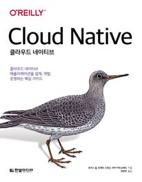

책 이름: 클라우드 네이티브  
출간일: 2020-06-23  
총평: 도서관에서 빌렸지만 사지는 않을듯. 번역이 너무 매끄럽지 않아서 가독성을 해치는 부분도 있다. 내용이 쉽지만은 않다. 도커, k8s 애플리케이션 등 내용에 대한 이해가 보장되어 있어야한다. 이스티오, 시타텔, 파일럿, 믹서 등 이런 단어들이 막 나온다. 여기에 aws에서 제공하는 서비스이름 등등 섞여 나오니 혼란이 좀 있었다.

총점: 2/5점

