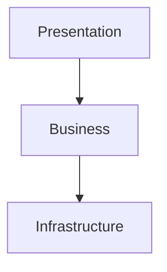
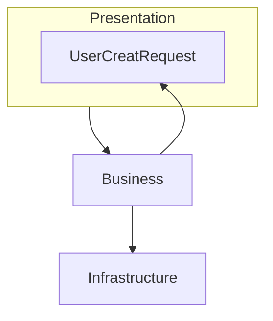
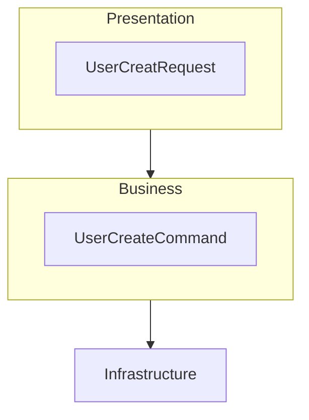

스프링 개발자가 많이 저지르는 '구조적 실수'에 대한 이야기다.

### 스마트 UI

첫 번째는 스마트 UI라는 안티 패턴이다. 
- 데이터 입출력을 UI에서 처리한다.
- 비즈니스 로직을 UI에서 처리한다.
- 데이터베이스와 통신하는 코드가 UI에 존재한다.

여기서 말하는 UI 일반적인 UI가 아닌, 백엔드에서의 UI(UserInterface)를 말한다. 백엔드의 UI는 API라고 말할 수 있다. 왜냐하면 프론트엔드 개발자는 백엔드 개발자의 User이고 소통하기 위한 인터페이스는 API이기 때문이다.

때문에 보통 API를 많이 작성하는 스프링의 **컨트롤러**가 UI라할 수 있겠다.

그럼 위의 조건은 컨트롤러에 너무 많은 책임이 있지 않은가?에 대한 질문이다.
컨트롤러에서 너무 많은 일을 처리하는것이 스마트 UI이고 안티패턴이다.

이어서 컨트롤러에 대한 역할에 대해 정의를 할 수도 있겠다.

컨트롤러는 API 호출방식을 정의하고, 어떤 비즈니스 로직을 실행할 지도 결정한다. 비즈니스 로직 자체가 컨트롤러에 포함되어있으면 안된다.

### 양방향 레이어드 아키텍쳐

레이어드가 무엇인가? 레이어드는 무언가 나누는 층이다. 보편적으로 레이어는 3개로 나뉘는데, Presentation, Business, Infrastructure 3가지로 나뉜다.
- Presetation은 사용자와 상호작용하는 최입단이라고 생각하면 된다. 입력을 받고 처리결과를 반환하는 곳이다. 스프링에서는 `컨트롤러`가 이 계층에 속할 것이다.
- Business는 비지니스 로직을 담당하는 곳이다. 데이터 유효성, 연산, 가공 등을 담당하는 곳으로 스프링에서는 `서비스`가 이 계층을 담당한다
- Infrastructure은 외부 시스템과의 상호작용을 하는곳이다. 데이터베이스와 상호작용을 하거나 외부 고객사 솔루션 등에 대한 요청을 처리하는 곳이다. 가끔 영속성 레이어라고 불리기도 하지만 데이터베이스만 연결되는곳은 아니기에 포괄적으로 Infrastructure라고 한다.

양방향 레이어드가 지향하고자하는 것은 **레이어 간 의존 방향은 단방향을 유지해야 한다**라는 것이다.

나는 처음에 무슨 소린가 했다.

당연히 보통



이런식으로 이동하는데 어떻게 역방향을 호출하나 했다.

만약 Presentation영역에서 `UserCreateRequest`를 `@RequestBody`를 통해 받았는데 이를 그대로 service에 넘기는 것을 상상해보자.

```java
//controller
public UserResponse create(@RequestBody UserCreateRequest userRequest){
    userService.create(userRequest);
}

//service
public User create(.., UserCreateRequest userRequest)
```



이렇게 될 것이다. 이게 바로 **양방향 레이어드**형태이고 안티패턴이다.
이것은 문제점은 UserCreateRequest가 수정되었을때 서비스 코드도 건들어야할 수도 있다는 것이다.

그러면 이를 해결하기 위해서는 어떻게 해야하나?

하나의 방법은 레이어별로 모델을 구성한다. 즉, Service를 위한 클래스를 하나 또 만드는 것이다. 만약 클래스를 하나 더 만들면 양방향 레이어드는 해결 된다.
예시로는 `UserCreateCommand`라는 클래스를 하나 더 만들었다. 



이렇게 하면 좋은점이 DTO가 분리되기에 Request에 `id`같은 값을 담을 필요가 전혀 없어진다는 겅시다. 책을 읽으면서 배운것인데, 보안적 이유에서 id같은 값은 `UserPrincipal`같은 객체에서 가져오는것이라고 한다.

단점도 존재하는데, 관리해야할 코드가 늘어나는것이다. 모델을 레이어별로 생성하면 갯수는 늘어나고 관리하는 비용이 증가한다. 책에서는 이렇게하다보면 유사한 클래스가 늘어날텐데, 두려워하지말고 늘리라고 한다. 그만큼 역할과 책임을 분리하는게 크다는 것이다.

**다른 방법은 공통 모듈을 구성하는 것**이다.

공통 모듈을 만들어서 그곳에 `UserCreateRequest`와 같은 모델들을 담는다. 참고로 레이어가 아닌 모듈이다. 모듈이라는 개념이 조금 어려운데 뒤에 또 나오니까 넘어가도 될듯하다.

### 완화된 레이어드

완화된 레이어드란 **상위 레이어에서 모든 하위 레이어에 접근가능한 레이어드 아키텍처**를 말한다.

예를 들어서 컨트롤러에서 레포지토리를 사용하는 경우다. 이런 경우 비지니스 로직을 어디에 추가하기가 굉장히 모호해진다. 결론은 이렇게 컨트롤러-레포지토리 사용을 직접적으로 하지말라는 것이다.

### 트랜잭션 스크립트

다음 안티패턴으로는 트랜잭션 스크립트가 있다. 이 안티패턴은 서비스 컴포넌트에서 발생하는 안티패턴인데, **서비스 컴포넌트의 구현이 어떤 트랜잭션이 걸려있는 스크립트를 실행하는 것 처럼 보일때**를 말한다.


```java
public class OrderService {

    public void processOrder(int userId, int productId, int quantity) {
        // 1. 사용자 조회
        User user = userRepository.findById(userId);
        if (user == null) {
            throw new RuntimeException("User not found");
        }

        // 2. 상품 조회 및 재고 확인
        Product product = productRepository.findById(productId);
        if (product == null || product.getStock() < quantity) {
            throw new RuntimeException("Product not available or insufficient stock");
        }

        // 3. 결제 처리
        boolean paymentSuccess = paymentProcessor.processPayment(user, product.getPrice() * quantity);
        if (!paymentSuccess) {
            throw new RuntimeException("Payment failed");
        }

        // 4. 주문 생성 및 저장
        Order order = new Order(user, product, quantity);
        orderRepository.save(order);

        // 5. 재고 감소
        product.setStock(product.getStock() - quantity);
        productRepository.save(product);
    }
}
```

이런 코드가 있다고 치자.

이런 코드는 모든비즈니스 로직이 한 곳에 집중되어있다. 책임이 분리되어있지않고 확장성도 부족하다.

이런 코드를 고치려면 다음과 같이 바꿀 수 있다.

```java
public class OrderService {

    private final PaymentService paymentService;
    private final StockService stockService;
    private final OrderRepository orderRepository;

    public Order createOrder(User user, Product product, int quantity) {
        if (!stockService.hasStock(product, quantity)) {
            throw new OutOfStockException("Insufficient stock");
        }

        Payment payment = paymentService.processPayment(user, product.getPrice() * quantity);
        if (!payment.isSuccessful()) {
            throw new PaymentFailedException("Payment failed");
        }

        Order order = new Order(user, product, quantity, payment);
        orderRepository.save(order);
        
        stockService.updateStock(product, quantity);
        
        return order;
    }
}
```

책임이 분리되어있고, 보가에도 좀 더 편해졌다. 그리고 OrerService는 각 서비스들이 뭘하는는지 모른다! 그냥 시키기만한다. 앞에서 말했던 객체지향적 코드로 작성되었다. 수정된 코드는 정말 잘 짰다!

뒤에어 서비스에대한 내용이 하나의 챕터로 나오며 수정된 코드가 왜 잘짜여진건지 알 수 있다.


