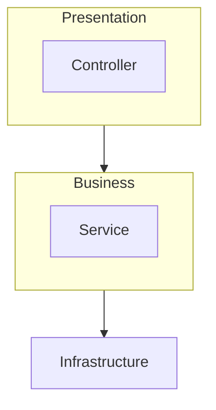

레이어드 아키텍처를 구성하기 위해서는 다음과 같은 요구조건들이 있다.

- 레이어 구조 사용
- 레이어 간 의존 방향은 단방향
- 인접한 레이어끼리만 통신 가능해야한다.



이 레이어 아키테처는 위 3가지 조건을 잘 갖춰다고 볼 수 있다.

아키텍처란 무엇인가? 아키텍처는 **정책과 제약 조건을 이용해 코드를 일관되고 논리적으로  만드는 것**이라고 생각한다고 한다. 

 프로젝트 특성마다 목적이 다를텐데, 그 목적에 맞게 제약조건을 프로젝트에 적용하여 코드를 일관되고 논리성있게 작성하는 것을 의미한다.

 그래도 **최소한**의 제약조건이 있다.

 - 레이어 구조를 사용한다.
 - 레이어 간 의존방향은 단방향으로 유지한다.

 -----

 만약 새로운 프로젝트를 진행해야할 때 무엇부터 만들것인가?

 JPA 엔티티? API 엔드포인트? 책에서는 둘 다 좋은 접근방법은 아니라고 한다.

 왜냐하면 JPA 엔티티 설계는 결국 테이블 구조를 먼저 설계하는 것이고, 협업에서는 이러한 부분때문에 병렬적으로 업무처리가 불가능하다고 한다.
 엔드포인트 설계는 구조적으로 딱 정하고 들어가는거라 별로라고 한다. 엔드포인트 설계하면 Http에 종속적이게 되는것이다. gRPC를 사용할 수도 있고 웹 소켓 또는 컨슈머 서버가 될 수도 있는데 HTTP 서버로 고정된다는 것이다.

 그래서 책에서 제안하는 것은 '**도메인**중심으로 프로젝트를 시작하라' 이다.

 도메인은 비즈니스 레이어에 속하긴 하지만 따로 분류하는게 낫다.

 그리고 도메인이 비즈니스 레이어에서 벗어나면서 비즈니스 레이어는 더이상 비즈니스 레이어가 아니다. Application(응용) 계층이 된다.

 ```mermaid
flowchart TD
    subgraph Presentation
    Controller
    end
    Presentation --> Application
    subgraph Application
    Service
    end    
    subgraph Domain
    domain
    end
    Application --> Domain
    Domain --> C[Infrastructure]
```


도메인 모델은 그 어떤 프레임워크와도 연관성을 가지면 안된다. JPA를 임포트하면 안되고 스프링 라이브러리를 임포트하면 안된다. 이는 도메인 모델이 다른 것들과 결합을 끊어내기 위함이다.

위의 구조도 완벽한 것은 아니다.결국 JPA를 사용한다면 JPA의존하게 되는데 코드 유지보수하다가 JPA가 아닌 다른 프레임워크를 사용하게 된다면 고쳐야할 것들이 많아진다. 이런경우 **의존성 역전**법칙으로 해결이 가능하다.


레이어드 아키텍처의 핵심은 유지보수성에 있는 것 같다.

프레임워크에 최대한 덜 의존적으로 구성하며, 언제든 사용하고 있는 기술이 바뀔 수 있고 그에 맞춰서 유연하게 대처가 가능한 구조.

이게 책에서 설명하는 알맞은 레이어드 아키텍처 구조같다.