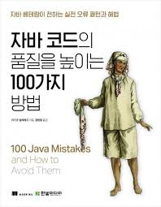

책 이름: 자바 코드의 품질을 높이는 100가지 방법

출간일: 2025-03-10

총평: 도서관에서 빌려서 읽어봤다.

도중에 읽다가 하차하게 되었는데, 그 이유는 책의 스타일이 나랑 맞지 않았다.

디자인 패턴 같았다. 사실 이런 류의 책은 독자가 문제를 겪고 고민해서 공감하여 문제에 대한 해결방법을 터득하는 과정이 중요하다 생각하는데, 모든 내용에 대해 공감하기 어려웠다. 어떤 부분은 깊이가 있었고 어떤 부분은 단순 개발자의 문법 오류를 지적하는데 이러한 방식이 크게 와 닿지 않은 것 같다.

나는 이 책이 OOP에 대한 내용일줄 알았다.하지만 그런 내용은 아니였다. 이 100가지에 대한 방법을 그 누가 머릿속에 들고 있겠는가. 

그래도 앞으로 개발을 하면서 한 번이라도 더 생각나면 좋을 것 같다.

하지만 아직 내가 이 책을 읽기에는 다른 공부할 것들이 너무 많다는 걸 깨달았다.

총점: 3/5점

