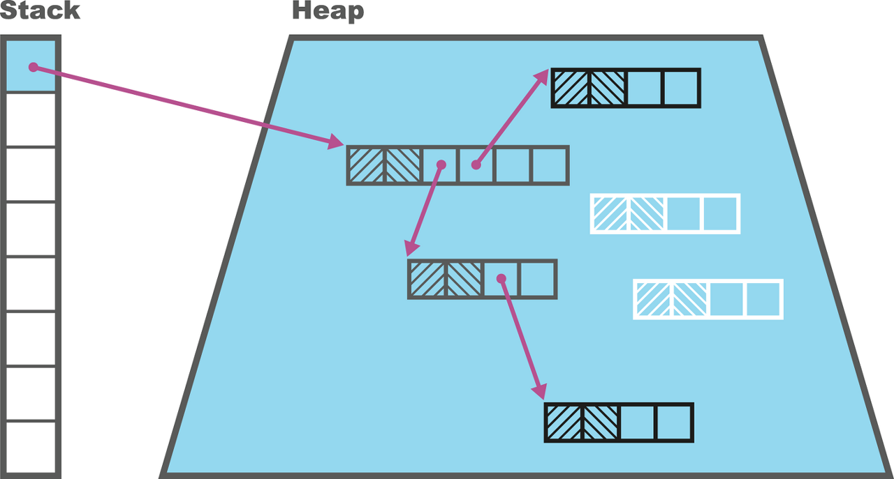

현대에서 자주 사용되는 가비지컬렉터에 대한 이야기

- G1GC
- ZGC
- Balanced
- 섀넌도어
...

이런 가바지컬렉터가 대거 등장한 이유는 가비지 컬렉터가 가진 특성들이 있기 때문이다.
트레이드오프를 지니고 있는데, 가비지 컬렉터에 소요되는 시간을 줄이면 애플리케이션의 성능이 저하될 수도 있고 압축을 진행하여 메모리 접근속도를 높이면 가비지 컬렉터에 소요되는 시간이 늘어나고.. 이런 것들이 있다. 모든 것들을 충족할 수는 없으며 각각 우선순위에 따라 다양한 가비지 컬렉터를 선택하면 되고, 각 가비지컬렉터가 어떤 장점을 지니고 있는지 확인하면 된다.

## 자바 가상 머신 세이프포인트

STW가 발생하면 애플리케이션 스레드를 중지해야하는데, 이는 가비지컬렉션이 직접하지는 않고 내부에서 실행되는 애플리케이션 스레드가 협력하여 중단하게 된다.

1. 자바 가상 머신이 전역적으로 '세이프포인트로 진입할 시간' 플래그를 설정
2. 개별 애플리케이션 스레드가 이 플래그를 감지하고 설정된 시간인지 확인
3. 스레드가 중단된 후 다시 깨울 때까지 대기

애플리케이션 스레드는 위 목적을 달성하기 위해 폴링방식을 사용하며 이런식으로 스레드가 멈추게 된다. 

가비지 컬렉션 내부 동작은 다음과 같은 **삼색 마킹**이라는 방식으로 진행된다.

- 가비지 컬렉터 루트는 회색으로 표시됩니다.
- 다른 노드(객체는) 흰색으로 표시됩니다.
- 마킹 스레드는 무작위로 회색 노드를 선택함.
- 선택된 노드에 흰색 자식 노드가 없으면, 해당 노드는 검은색으로 변경됨.
- 반대로 흰색 자식 노드가 있다면, 마킹 스레드는 해당 자식 노드를 회색으로 변경한 후 탐색을 계속함.
- 이 과정을 회색 노드가남지 않을 때까지 반복
- 검은색 객체는 도달 가능한 것으로 판명되어 수집하지 않음.
- 반면, 흰색 노드는 도달할 수 없는 객체로 간주되어 가비지 컬렉션의 대상이 됨.

출처: https://www.google.com/imgres?q=%EC%82%BC%EC%83%89%EB%A7%88%ED%82%B9&imgurl=https%3A%2F%2Fblog.kakaocdn.net%2Fdn%2FB3Ma8%2FbtssCt7uEaq%2FOgKzGudSi6DaprkKYCXiR1%2Fimg.png&imgrefurl=https%3A%2F%2Fgksdudrb922.tistory.com%2F297&docid=XYcvc87nvkADUM&tbnid=6oQ6llmI0uBaeM&vet=12ahUKEwjF7JLu__eNAxWse_UHHRXVDOsQM3oECGoQAA..i&w=1280&h=687&hcb=2&ved=2ahUKEwjF7JLu__eNAxWse_UHHRXVDOsQM3oECGoQAA

위 알고리즘을 사용하는 컬렉터는 실행 중인 애플리케이션 스레드에서 변경된 객체가 잘못 수집되지 않도록 추가적인 처리가 필요함. 이를 해결하기 위한 여러 방법들이 존재하고 그 중 G1이 사용하는 리마크 방법이 있다.

### 포워딩 포인터

각 객체에 추가적인 메모리 공간을 사용하여 해당 객체에 이전 가비지 컬렉션 단계에서 재배치 되었는지 여부를 나타내고, 객체의 새로운 위치를 가리키는 정보를 제공한다.

예시

1.	객체 A가 Eden 영역에 있음.
2.	객체 A가 살아있으므로 SurvivorTo로 복사.
3.	Eden의 객체 A 자리에 “나는 새 주소는 0x1234야” 라는 포워딩 포인터를 남김.
4.	객체 B가 객체 A를 참조하고 있다면:
    - B가 A를 따라가면 포워딩 포인터가 있음.
    - GC는 포워딩 포인터를 따라 새 주소(0x1234)로 연결 갱신.

이런식으로 객체들을 연결하여 추적한다.

여기에는 명확한 단점이 있는데, 객체당 하나의 메모리 단어가 추가로 필요하여 공간에 대한 오버헤드를 초래한다. 이 기법은 실제 셰넌도어와 같은 고급 컬렉터에서 사용되며, 문제를 해결한 방식도 뒤에 나온다고 한다.

## G1 GC

자바 8 이후 버전에서 핫스팟 가상 머신의 기본 가비지 컬렉터이다.

- 가장 핵심 개념은 **일시 정지 목표**
    - 개발자는 GC주기마다 일시 정지해야 하는 최대 시간을 설정할 수 있음. 기본값은 200ms이지만 보통 더 빠르게 끝나므로 기본값만 써도 충반함. 매우 큰 힙을 가진 경우에는 조절이 필요할 수 있다.
- 기존과 달리 힙은 고정 크기의 영역 개념을 기반으로 하고, 이를 모여 **세대**를 구성함. 
- 자바 21부터 G1의 알고리즘은 2의 제곱 MB크기의 영역을 허용함.(최대크기 512MB)
- 기본적으로 G1은 힙에서 2,048에서 4.095개의 영역을 기대하며, 이를 달성하기 위해 영역 크기를 조정함.
- 애플리케이션에서 영역크 크기의 절반보다 큰 객체를 생성하는 경우, 이는 humongous 영역에 직접 할당됨. 

- 컬렉션은 2가지 유형의 컬렉션이 존재
    - 젊은 세대 컬렉션
        - 가능한 한 빨리 힙을 회수하려고 하는 STW 컬렉션
    - 혼합된 세대 컬렉션

