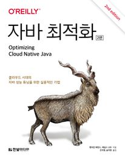

책 이름: 자바최적화

출간일: 2025-05-26

총평: 도서관에서 빌려서 읽어봤다.
 글을 작성하는 기준으로는 최신에 작성되어서 선택하였는데.. 제일 불편한거는 **번역**이였다. 번역이 매끄럽지 않아 가독성을 헤쳤고, 이해하기 어려웠다. 또한 어떤 개념을 설명할 때, 설명이 자세하다고 할 수는 없어 이해가 어려웠다. 어떤 기술을 '왜 쓰는가'에 대한 해답은 독자가 알아서 찾아가야했다.

키워드 중심으로 학습을 하면 좋을 책이라서 키워드 작성은 따로 또 진행해볼 법했다. 

- 번역으로 인한 가독성 저하
- 그래도 키워드 중심으로 학습은 괜찮다.

총점: 3/5점

