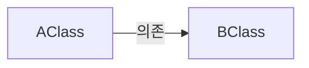
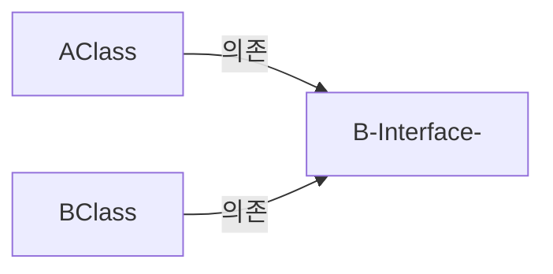

SOLID라는 말은 많이 봤을 것이다. 유지보수성과 확장성을 높이는 개발원칙이다.
- S: 단일 책임 원칙(Single Responsiblity Principle)
- O: 개방 패쇄 원칙(Open Closed Principle)
- L: 리스코프 치환 원칙(Liskov Subsitution Principle)
- I: 인터페이스 분리 원칙(Interface Segregation Principle)
- D: 의존성 역전 원칙(Denpendency Inversion Principle)

자세한 설명은 검색해도 많이 나오기에 이 책에서 나온 내용을 보고 느낀점, 또는 인용하여 정리하겠다.

유지보수성은 무엇인가? 

1. 코드 변경으로 인한 영향 범위가 어느정도 되는가?
2. 의존성 관리가 제대로 되고 있는가?
3. 쉽게 확장이 가능한가?

SOLID원칙은 위 질문에 대한 해답을 준다. 영향범위는 축소하고 의존성관리는 쉬워지고 확장도 쉬워진다.

### 단일 책임 원칙

이 원칙의 키워드는 **책임**인데 책임을 정의하기 전에는 **액터**라는 개념을 정립해야한다.

- 액터: 메시지를 전달하려는 주체

즉, 어떤 클래스를 사용하게 될 액터가 1명(개)라면 단일 책임 원칙을 지키고 있는 것이고, 여럿이면 위반하고 있는 것이다.

따라서 액터가 1명이라면 클래스를 변경할 이유도 하나로 고정된다. 여러 액터가 사용하고 있다면 하나의 클래스를 수정할 해당 클래스를 사용하는 액터들도 수정될 위험이 있기 때문이다.


### 개방 폐쇄 원칙

이 원칙의 목표는 변경으로 인한 영향 범위를 최소화하고 확장하기 쉽게 만들라는것이다.
나의 생각으론 구현체를 만들 생각보다는 인터페이스, 등을 두어 기존 코드를 최대한 안 건들게 하는거 아닌가 싶다.

### 리스코프 치환 원칙

기본 클래스의 계약을 파생 클래스가 제대로 치환할 수 있는가?

```java
@Getter
@Setter
@AllArgsConstructor
public class Rectangle {

    protected long width;
    protected long height;

    public long calculateArea() {
        return width * height;
    }
}

class Square extends Rectangle {
    public Square(long length) {
        super(length,length);
    }
}

//Test

@Test
void 리스코프_치환테스트(){
    Rectangle rectangle = new Square(10);
    rectangle.setHeight(5);
    System.out.println(rectangle.calculateArea()); //결과 50 원하는결과 25
}
```

위 코드는 대표적인 리스코프 치환 원칙 위반 사례이다.

```java
//Square에 해당 내용 추가
    @Override
    public void setWidth(long width) {
        super.setWidth(width);
        super.setHeight(width);
    }
    
    @Override
    public void setHeight(long height) {
        super.setHeight(height);
        super.setWidth(height);
    }
```

이러면 해결이 되는가? 안된다. 의도에서 벗어났기 때문이다.

setHegiht나 setWidth나 둘 다 자기 속성(setHeight -> height) or (setWidth -> width)뿐 만아니라 다른 속성까지 건들고 있다.

이 부분에서 의도치않은 실수를 발생시킬 수 있다.

리스코프 치환원칙을 완벽히 지키기는 어렵다. 이를 지키기에는 초기 코드 작성자의 의도를 파악해야하는데, 직접 물어보는데에도 커뮤니케이션 비용이 있고 만약 퇴사자라면? 의도를 알기가 어렵다.

이렇기에 **테스트**코드를 작성하여 작성자의 의도를 포함시킬 수 있다. 
즉, 테스트 코드를 작성하여 초기 코드의 의도를 다른 사람들도 알 수 있게 하자.

### 인터페이스 분리 원칙

간단하게 인터페이스에 대한 중요성을 나타내는 것인데, 어떤 클래스가 자신에게 필요하지 않은 인터페이스의 메서드를 구현하거나 의존하지 말아야한다는 것이다.

또한 하나의 인터페이스로 모든걸 해결하려고할 때에도 위배된다.

인터페이스는 구현을 강요하는데, 특정 클래스에서 필요없는 메서드를 인터페이스에 함부로 추가했다가는 해당 클래스에서 구현을 강제하게되어 쓸모도없는 코드를 작성하게 된다. 

### 의존성 역전 원칙

고수준/저수준 모듈이 추상화에 의존해야 한다는 원칙이다. 이를 이해하기 위해서는 **의존성**에 대해서 알아야한다.


## 의존성

의존성에서의 **의존**이란 다른 객체나 함수를 사용하는 상태를 말한다. 

```java
A class {
    void method(Bclass B){

    }
}
```

위와같은 수도코드가 있다고 하자. Aclass는 Bclass형태의 인자를 받는 메서드가 구현되어있다.
위의 정의로 인하여 Aclass는 Bclass의 객체를 사용하므로 **Aclass는 Bclass에 의존적이다**라고 할 수 있다. 사용하기만해도 의존적이다라고 할 수 있다.

의존을 표현하는 다른 언어로는 **결합**이 있는데, 우리는 이 의존도를 줄이기 위해 노력해야한다. 그 방법으로는 **의존성 주입**기법이 있다.

의존성 주입을 적용하는 방법은 간단하다. 필요한 의존성을 외부에서 주입하면된다.

```java
class HambugerChef {
    public Food make() {
        Bread bread = new WheatBread();
        Meat meat = new Beef();
        ...

        return Hambuger.builder()
                .bread(bread)
                .meat(meat)
                ...
    }
}
```

위 코드에서는 make()함수에서 구현체를 직접 생성해서 사용하고 있다.

문제가 있는데, 만약 Meat에 사용하고 있는 소고기(Beef)를 돼지고기(pork)로 변경하려면 이 코드를 변경해야한다. 근데 만약 위 코드를 이렇게 바꾸면 어떻게 되는가

```java
class HambugerChef {
    public Food make(Bread bread, Meat meat) {
        return Hambuger.builder()
                .bread(bread)
                .meat(meat)
                ...
    }
}
```

이렇게 코드를 변경하면 만약 돼지고기로 고기종류를 바꾼다고한들 HambugerChef코드를 건들 필요도 없다. 이렇게 의존성을 외부에서 받는것을 **의존성 주입**이라고 한다.

의존성 주입에는 종류가 있는데

```java
class HambugerChef {
    private Bread bread;
    private Meat meat;
    public HambugerChef(Bread bread, Meat meat) {
        this.bread = bread;
        this.meat = meat;
    }

    public Food make(Bread bread, Meat meat) {
        return Hambuger.builder()
                .bread(bread)
                .meat(meat)
                ...
    }
}
```

이처럼 생성자에서 주입을 받으면 **생성자 주입**이라고 한다. 외에도 **수정자 주입**이 있지만 해당 기법은 추천하지 않으므로 궁금하면 찾아보는게 나을 것 같다. 참고로 `@Autowired`는 필드주입으로 되어있다.

위의 코드를 통해서 의존성을 줄일 수 있었다. 의존성 자체를 없애는 것은 불가능하지만 최소한의 의존성만 유지하게끔 할 수 있다는 것이다. 그래서 의존성 주입은 의존성을 제거하는 것이 아닌, 의존성을 약화시키는 기법이다.

또한 `new`의 사용을 최대한 자제함으로써 의존성을 줄일 수 있다. `new`를 사용함으로써 '어떤 객체를 사용하겠다'라고 타입을 고정시켜, 강한 의존성을 지니게 하기 떄문이다.

## 의존성 역전

그래서 의존성 역전이 무엇을 의미하는가?



이런 의존성을 갖고있는 클래스가 있을때 BClass에 대한 인터페이스를 추가했다고 해보겠다.


AClass입장에서는 B인터페이스를 의존하는것 말고는 바뀐게 없다.
하지만 BClass는 의존을 받던 입장에서 BInterface를 구현해야하므로 BInterface를 의존하게 되었고, 때문에 화살표 방향이 바뀌게 되었다.

이러한 관계를 의존성이 **역전**되었다고 볼 수 있다. 의존성 역전으로 인해서 코드가 구현체가 아닌 추상화(인터페이스)에 의존하는 형태로 바뀌었다.

의존성 역전의 원칙의 장점 중 하나는 여러 클래스들을 모듈로 나뉠때에도 설계하기 좋다는 것에 있다. 상위모듈이 하위모듈의 인터페이스에 의존해있으면 하위모듈의 구현체는 어느걸 가져다써도 상위모듈은 전혀 신경안쓰도록 구현할 수 있게해주는 초석을 마련해준다.

스프링에서도 자연스럽게 컨트롤러-서비스-레포지토리 이렇게 의존성을 설계하는 경우가 많은데 컨트롤러-서비스 사이에 인터페이스를 두는 이유도 의존성 역전을 위한 것이고 서비스-레포지토리 사이에도 인터페이스를 두는것도 마찬가지의 이유이다.

결국에 의존성이 강조되는 이유는 **코드를 변경하거나 확장할 때 영향받는 범위를 최소화함**에 있다.


의존성을 설계할때 주의해야할 것은 **순환 참조**를 일으키고 있는지 여부를 판단해야한다.
의존성 그래프에 사이클이 있으면 순환 참조를 만들어내는데 이렇게 되면 코드를 수정할때 사이클로 인하여 무수히 많은 곳을 수정해야할 수도 있다.


## 결론

SOLID는 객체지향적인 코드는 아니다. SOLID의 목표는 응집도를 높이고 결합도는 낮추려는 하나의 설계 원칙이다. SOLID가 추구하는 바를 고심하고 설계하다보면 **디자인 패턴**으로 알려져있는 여러 패턴에 자연스레 접하게 되는것이다. 그래서 디자인 패턴 공부할 필요없다. 객체지향 원칙과 SOLID가 추구하는바 등을 고려하면서 설계하고 코드를 작성하다보면 자연스레 습득되는 것이다.

그리고 모든것을 패턴화 할 수도 없고, 패턴이 모든 상황에 정답인것도 아니다. 그러기에 해당 패턴이 나온 이유와 추구하는 방향 등을 좇는것이 좋다.


