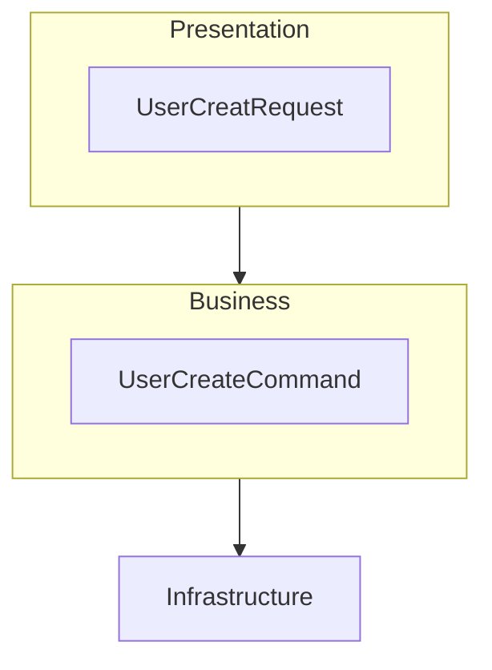

레이어드 아키텍처를 구성하기 위해서는 다음과 같은 요구조건들이 있다.

- 레이어 구조 사용
- 레이어 간 의존 방향은 단방향
- 인접한 레이어끼리만 통신 가능해야한다.

```mermaid
flowchart TD
    subgraph Presentation
    UserCreatRequest
    end
    Presentation --> Business
    subgraph Business
    UserCreateCommand
    end    
    Business --> C[Infrastructure]
```

이 레이어 아킥테처는 위 3가지 조건을 잘 갖춰다고 볼 수 있다.

