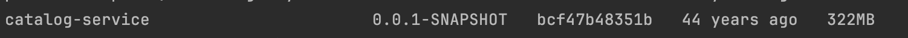

클라우드 네이티브 애플리케이션을 개발하기 위해서는 15요소(12 + 3) 방법론에서 출발할 수 있다.

### 15가지 방법론

1. 하나의 코드베이스, 하나의 애플리케이션
    - 설정 같은것은 외부로 빼서 코드베이스를 다시 실행핧 필요없게 해야함. 아티팩트는 모두 동일하게 가져간다.
    - 공유코드 또한 본인의 코드베이스를 가지고 있고, 의존성 라이브러리로 포함되거나 독자적으로 실행될 수 있어야한다.
2. API 우선
    -  API를 먼저 설계하여 견고해지고 테스트를 용이하게 하여 개발 생산성을 올리자는 이야기
3. 의존성 관리
    - 의존성 라이브러리툴이 중앙 저장소에서 다운받을 수 있어야함. (가볍게 넘기면 될듯하다.)
4. 설계, 빌드, 릴리스, 실행
    - 각 분리를 해야하며, 빌드 아티팩트는 불가변 + 고유 식별 가능해야한다.
5. 설정, 크리덴셜 및 코드
    - 설정: 배포 사이에 변경될 수 있는 모든 것
        - 설정이 변경된다고해서 재빌드되거나 코드변경이 있는 등의 일이 있으면 안됨.
    - 즉, 설정은 코드와 분리되어야한다. default설정은 제외
6. 로그
    - 애플리케이션이 신경쓰지 말아야한다. 로그수집기 툴 등으로 로그를 수집한다.
7. 일회성
    - 언제라도 애플리케이션은 중지되었다가 시작될 수 있다. 
    - 애플리케이션이 문제가 생기면 종료했다가 띄우면 그만, 부하가 증가하면 하나 더 띄우면 그만
    - graceful shutdown을 사용하여 시스템의 복원력과 탄력성을 높힌다.
8. 지원 서비스
9. 환경 동일성
    - 모든 환경을 가능한한 비슷하게 사용. DB 및 버전과 같은 사례
10. 관리 프로세스
    - 데이터 마이그레이션, 배치와 같은 일회성 프로세스같이 애플리케이션을 관리하기 위한 프로세스 정립
11. 포트 바인딩
    - 포트 바인딩을 통해 서비스를 제공해야함.
12. 상태를 갖지 않는 프로세스
    - 애플리케이션 인스턴스간에 상태를 공유하지 않아야함.
    - 상태는 저장해야하는데, 상태를 갖지 않는 애플리케이션의 상태관리는 지원서비스(DB,등)에 위앰해야한다는 말
13. 동시성
14. 원격 측정
    - 클라우드 분산시스템을 관리, 모니터링하기 위한 원격측정이 필요
15. 인증 및 승인
    - 인증을 통해 어떤 사용자가 접근했는지 알 수 있음. 권한 확인을 통해 특정 작업을 수행하는지도 확인이 가능

    

이후 책에서는 spring 데모 예제, 도커,쿠버네티스에 대한 설명을 하고 있다.

`./gradlew bootBuildImage`라는 명령어를 통해 도커파일을 작성하지 않고 소스코드를 컨테이너 이미지로 자동 변환하게끔 하는데 이는 신기했다.




### minikube install

```
minikube start --driver=docker
```

path관련 오류가 발생하면 docker 삭제했다가 `brew install --cask docker`로 재설치해주면 해결된다.

